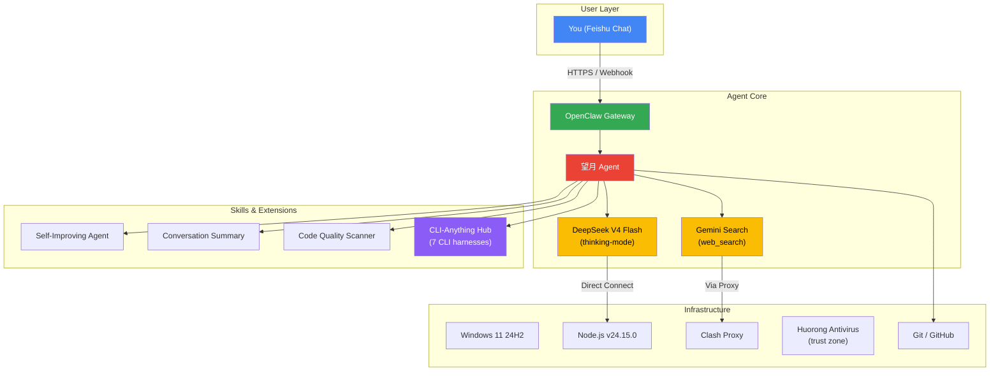

# 望月 (WenYue) — OpenClaw AI Agent Operating System

> **An intelligent research & development assistant, deployed on Windows via OpenClaw, engineered through real battlefield debugging.**

## Overview

This repository documents the complete lifecycle of deploying, configuring, and operating **望月** — an OpenClaw-based AI agent serving as a tech R&D and intelligence analysis assistant. The agent runs locally on Windows 11, communicates through Feishu (Lark), and supports deep thinking via DeepSeek V4 Flash.

**This is not a code library. This is a record of systems engineering in practice.**

---

## Architecture



---

## Key Engineering Challenges Solved

### 1. Gateway Upgrade Hell (`2026-05-13`)
| Problem | Root Cause | Solution |
|---------|-----------|----------|
| Zombie Node processes blocking port | Previous manual launch left orphan processes | `taskkill /F /IM node.exe` — clean kill |
| Node.js version mismatch | PATH pointing to old Node v22.13.0, needed ≥22.14 | Physically removed old dir, reinstalled v24 |
| CLI command broken | Global npm symlinks broke after engine swap | `npm install -g openclaw` |
| Panel isolation auto-destruction | Panel renamed executable to `.bak` | Re-ran global install; **never click "Isolate"** |
| API connection timeout | Proxy interference with DeepSeek API | Cleared proxy field in Panel; DeepSeek must connect directly |

### 2. Triple-Layer Network Stack Debugging (`2026-05-15`)
- **Layer 1 — DNS**: Default DNS resolver took 11.4s for api.deepseek.com → switched to Alibaba DNS (223.5.5.5) + Cloudflare (1.1.1.1). Resolution dropped to **16–20ms**.
- **Layer 2 — Proxy**: Clash TUN mode forced all traffic through overseas nodes → switched to system-proxy-only. DeepSeek requests no longer detoured.
- **Layer 3 — Runtime**: Node.js `undici` engine case-sensitive environment variables → uppercase `NO_PROXY` was silently ignored. Changed to lowercase `no_proxy: localhost,127.0.0.1,.deepseek.com`.

**Result**: model-resolution/auth latency dropped from 30–65s to **0ms/6ms**. Sub-second response restored.

### 3. Startup Crash Triple-Layer Diagnosis (`2026-05-17`)
- **Network**: WebSocket handshake timeout → tauri.localhost not in allowedOrigins. Fixed: `["*"]` temporary allow.
- **System**: Huorong antivirus scanning Node.js modules at startup → disk I/O blocking for **93s**. Fixed: added to trust zone (93s→26s).
- **Compute**: Sessions JSONL files bloated with corrupt data → Node.js single-threaded deserialization stalled Event Loop for **148s**. Fixed: isolated sessions directory, system auto-recreated fresh sessions. **Zero data loss** (workspace files unaffected).

### 4. Model Architecture Reform (`2026-05-19`)
- Initial architecture used a **two-tier model routing** (V4 Flash for daily → spawn R1 sub-agent for deep thinking).
- Discovered DeepSeek V4 Flash natively supports `thinking` parameter with `reasoning_effort` — making R1 independent agent obsolete.
- **`deepseek-reasoner` deprecated 2026/07/24** — this migration was done proactively.
- Simplified to single-model architecture: V4 Flash handles everything with thinking mode as needed.

---

## Repository Structure

```
├── AGENTS.md          # Agent behavior rules and conventions
├── SOUL.md            # Core behavior algorithm & identity logic
├── IDENTITY.md        # System identity specification
├── HEARTBEAT.md       # Cron scheduling & autonomous operation protocol
├── MEMORY.md          # Distilled long-term memory / engineering chronicle
├── TOOLS.md           # Tool configuration and usage rules
├── memory/            # Daily operational logs (key troubleshooting preserved)
│   ├── 2026-05-13.md              # Identity restructuring + upgrade
│   ├── 2026-05-15-troubleshooting.md  # DNS + Proxy + Runtime debugging
│   ├── 2026-05-17.md              # Startup crash triple-layer fix
│   └── ...
└── skills/            # Extensible skill modules
    ├── self-improving-agent/      # Auto conversation quality analysis
    ├── conversation-summary/      # Chat content summarization
    └── ...
```

---

## Tech Stack

| Layer | Technology |
|-------|-----------|
| AI Model | DeepSeek V4 Flash (thinking-capable) |
| Agent Framework | OpenClaw v2026.5.7 |
| UI Channel | Feishu (Lark) |
| Search Grounding | Gemini API (Google) |
| Runtime | Node.js v24.15.0 |
| OS | Windows 11 24H2 (x64) |
| Proxy | Clash (system proxy mode) |
| Version Control | Git (this repo) |

---

## Lessons Learned

This project distilled into a repeatable engineering checklist:

1. **Always check official docs before assuming model capabilities** — DeepSeek V4 absorbed thinking mode, making the old R1 routing totally unnecessary
2. **DeepSeek API must connect directly** — any proxy interfered with stability. TUN mode is destructive for API calls
3. **Session cache files are disposable** — always back up `workspace/*` (identity, memory, config) but `sessions/*` can be safely nuked
4. **Windows needs antivirus trust zones** for Node.js heavy I/O at startup
5. **Three-layer debugging**: always go Network Layer → System Layer → Compute Layer

---

## License

MIT — This repository documents engineering experience. Feel free to reference, fork, or learn from it.

---

*Built by [KuuhhN](https://github.com/KuuhhN) · Maintained by 望月*
