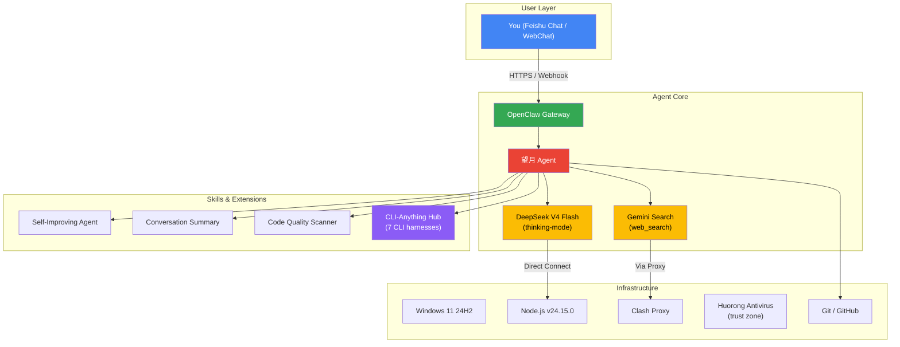

# 望月 (WangYue) — OpenClaw AI Agent 本地部署实战记录

> **一个软件工程大学生从零到一，在 Windows 上把 OpenClaw AI Agent 跑起来、踩平、调优的全过程。**

```
🟢 如果你正准备在 Windows 上部署 OpenClaw
🟢 如果你对 AI Agent 感兴趣但被技术文档劝退
🟢 如果你想看一个和你水平差不多的人是怎么搞定这件事的
```

**那你来对地方了。**

---

## 📖 为什么有这个仓库

2026 年 3 月，我（一个普通的软件工程大学生，技术栈 ≈ 课程设计水平）决定在本地跑一个 AI Agent。

然后我就开始了为期两个月的踩坑之旅：

- 装好了 Node.js → 版本不对
- 版本对了 → 启动不了
- 启动了 → 卡死
- 不卡了 → 网关连不上
- 连上了 → DNS 解析 11 秒
- 修好了 → 杀毒软件又把启动拖到 93 秒
- 解决了 → 飞书又断了
- ……

两个月后，我部署的 AI Agent（望月）稳定运行，做到了：

```
DNS 解析    11.4s  → 16ms    ↓ 700x
API 认证    30-65s → 6ms     ↓ 5000%
网关启动    93s    → 26s     ↓ 72%
Event Loop  148s  → 0ms     恢复正常
```

**这个仓库就是这一切的记录。** 它不是一份官方文档的复述，而是一个普通人在 AI 工程落地中真实踩坑、真实排障、真实记录的过程。

如果你也在部署 OpenClaw 或者类似项目，这些记录能帮你**跳过我踩过的所有坑**。

---

## 📦 核心内容

```
📁 部署实录
│
├── 🎯 升级踩坑全记录（5 个连环故障）
│   ├── 僵尸进程占端口 → 强杀
│   ├── Node.js 版本断层 → 物理重装
│   ├── 全局 CLI 断裂 → npm rebuild
│   ├── 面板隔离误杀 → 千万不能点"隔离"
│   └── API 网络阻断 → DeepSeek 必须直连
│
├── 🌐 网络栈三层排障
│   ├── DNS 调优：11s → 16ms（阿里云+Cloudflare）
│   ├── 代理劫持：TUN 模式是元凶
│   └── undici 环境变量：大写 NO_PROXY 被忽略
│
├── 🔌 Gateway 启动卡死三阶段排障
│   ├── 跨域配置：tauri.localhost 被拦截
│   ├── 杀毒软件：火绒实时扫描拖慢 93s
│   └── 会话文件：trajectory.jsonl 膨胀导致 148s 阻塞
│
├── 🧠 模型架构重构
│   ├── 从双模型路由 → 单模型思维链
│   └── V4 Flash thinking-mode 替代独立 R1 agent
│
├── 📅 Cron 定时任务体系
│   ├── AI 新闻日报自动收集
│   ├── Git 自动备份
│   ├── 系统健康自检
│   └── Session 文件自动清理
│
└── ⚙️ 配置模板
    ├── openclaw.json（带注释的完整配置）
    ├── proxy 环境变量配置
    └── no_proxy 白名单
```

---

## 🔧 Quick Start（中文快速上手）

```bash
# 1. 确保 Node.js >= v22.14.0
node --version

# 2. 全局安装 OpenClaw
npm install -g openclaw

# 3. 如果要飞书作为聊天界面，配置飞书机器人
# 4. 如果是 DeepSeek API，配置直连（不要走代理）
# 5. 如果 Windows 有杀毒软件，加入信任区加速启动
```

每一步的详细教程和踩坑记录都在下面的英文章节中。

---

## Architecture



---

## Key Engineering Challenges Solved

### 1. Gateway Upgrade Hell (`2026-05-13`)
| Problem | Root Cause | Solution |
|---------|-----------|----------|
| Zombie Node processes blocking port | Previous manual launch left orphan processes | `taskkill /F /IM node.exe` — clean kill |
| Node.js version mismatch | PATH pointing to old Node v22.13.0, needed ≥22.14 | Physically removed old dir, reinstalled v24 |
| CLI command broken | Global npm symlinks broke after engine swap | `npm install -g openclaw` |
| Panel isolation auto-destruction | Panel renamed executable to `.bak` | Re-ran global install; **never click "Isolate"** |
| API connection timeout | Proxy interference with DeepSeek API | Cleared proxy field in Panel; DeepSeek must connect directly |

### 2. Triple-Layer Network Stack Debugging (`2026-05-15`)
- **Layer 1 — DNS**: Default DNS resolver took 11.4s for api.deepseek.com → switched to Alibaba DNS (223.5.5.5) + Cloudflare (1.1.1.1). Resolution dropped to **16–20ms**.
- **Layer 2 — Proxy**: Clash TUN mode forced all traffic through overseas nodes → switched to system-proxy-only. DeepSeek requests no longer detoured.
- **Layer 3 — Runtime**: Node.js `undici` engine case-sensitive environment variables → uppercase `NO_PROXY` was silently ignored. Changed to lowercase `no_proxy: localhost,127.0.0.1,.deepseek.com`.

**Result**: model-resolution/auth latency dropped from 30–65s to **0ms/6ms**. Sub-second response restored.

### 3. Startup Crash Triple-Layer Diagnosis (`2026-05-17`)
- **Network**: WebSocket handshake timeout → tauri.localhost not in allowedOrigins. Fixed: `["*"]` temporary allow.
- **System**: Huorong antivirus scanning Node.js modules at startup → disk I/O blocking for **93s**. Fixed: added to trust zone (93s→26s).
- **Compute**: Sessions JSONL files bloated with corrupt data → Node.js single-threaded deserialization stalled Event Loop for **148s**. Fixed: isolated sessions directory, system auto-recreated fresh sessions. **Zero data loss** (workspace files unaffected).

### 4. Model Architecture Reform (`2026-05-19`)
- Initial architecture used a **two-tier model routing** (V4 Flash for daily → spawn R1 sub-agent for deep thinking).
- Discovered DeepSeek V4 Flash natively supports `thinking` parameter with `reasoning_effort` — making R1 independent agent obsolete.
- **`deepseek-reasoner` deprecated 2026/07/24** — this migration was done proactively.
- Simplified to single-model architecture: V4 Flash handles everything with thinking mode as needed.

---

## Repository Structure

```
├── AGENTS.md          # Agent behavior rules and conventions
├── SOUL.md            # Core behavior algorithm & identity logic
├── IDENTITY.md        # System identity specification
├── HEARTBEAT.md       # Cron scheduling & autonomous operation protocol
├── MEMORY.md          # Distilled long-term memory / engineering chronicle
├── TOOLS.md           # Tool configuration and usage rules
├── memory/            # Daily operational logs (key troubleshooting preserved)
├── scripts/           # System automation scripts (sessions cleanup, etc.)
└── skills/            # Extensible skill modules
    ├── self-improving-agent/      # Auto conversation quality analysis
    ├── conversation-summary/      # Chat content summarization
    └── ...
```

---

## Tech Stack

| Layer | Technology |
|-------|-----------|
| AI Model | DeepSeek V4 Flash (thinking-capable) |
| Agent Framework | OpenClaw v2026.5.7 |
| UI Channel | Feishu (Lark) / WebChat |
| Search Grounding | Gemini API (Google) |
| Runtime | Node.js v24.15.0 |
| OS | Windows 11 24H2 (x64) |
| Proxy | Clash (system proxy mode) |
| Version Control | Git (this repo) |

---

## Lessons Learned

This project distilled into a repeatable engineering checklist:

1. **Always check official docs before assuming model capabilities** — DeepSeek V4 absorbed thinking mode, making the old R1 routing totally unnecessary
2. **DeepSeek API must connect directly** — any proxy interfered with stability. TUN mode is destructive for API calls
3. **Session cache files are disposable** — always back up `workspace/*` (identity, memory, config) but `sessions/*` can be safely nuked
4. **Windows needs antivirus trust zones** for Node.js heavy I/O at startup
5. **Three-layer debugging**: always go Network Layer → System Layer → Compute Layer

---

## 💡 If This Helped You

这个仓库的所有内容都是公开免费的。如果我的踩坑记录帮你省下了时间：

- ⭐ **点个 Star** — 让更多人看到
- 🐛 **提 Issue** — 如果你也遇到了我没写到的坑
- ☕ **请我喝杯咖啡** — 爱发电: [你的链接]

你的支持会让一个大学生更有动力继续写下去 🙏

---

## License

MIT — This repository documents engineering experience. Feel free to reference, fork, or learn from it.

---

*Built by [KuuhhN](https://github.com/KuuhhN) · Maintained by 望月*
